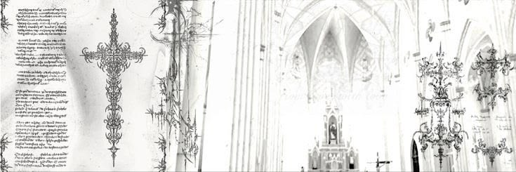

  

# Olá, Prazer. Meu Nome é Raphael 💻

**Beginner Back-end Developer 🏳️**

 

## Sobre mim

- ◽ Desenvolvedor back-end iniciante, sempre estudando e evoluindo
- ◽ Uso **Arch Linux** com **KDE Plasma** no dia a dia
- ◽ Focado em construir projetos completos, do back ao front

 

## Stack

 

## Ferramentas

 

## Contato

