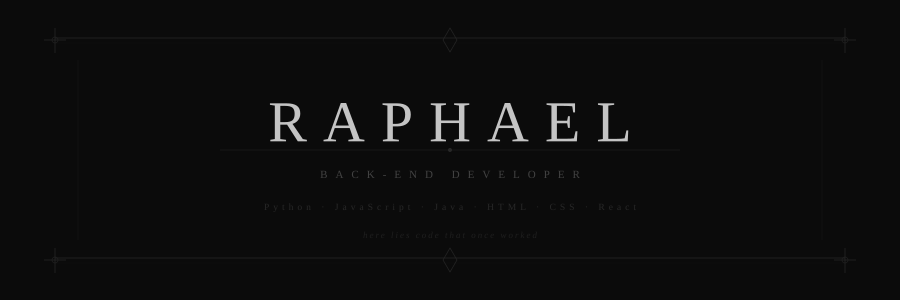

  

 

&nbsp;

 

## Sobre

Olá! Meu Nome é Raphael Henrique, Sou Desenvolvedor back-end focado em construir sistemas que funcionam de verdade.  
trabalho principalmente com Python e JavaScript, mas não fujo de Java quando precisa.  
Linux no dia a dia, terminal aberto, café do lado.

 

## Linguagens

 

## Ferramentas & Ambiente

 

## Estatísticas

 

## Contato

---

feito com silêncio e muito terminal

